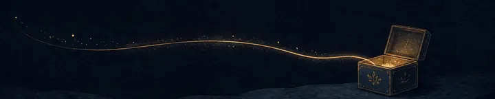

  

  <h2>方寸代码藏山海，一行一思筑星河。</h2>

  

    你好，我是 adnaan。 
    我做 AI 工具、桌面应用和一些有趣的小产品， 
    也在 <a href="https://github.com/Spark-Relics">Spark Relics</a> 收藏值得留下的开源创意。
  

  

    <a href="https://www.adnaan.site">Blog</a> ·
    <a href="https://github.com/ad-naan?tab=repositories">Projects</a> ·
    <a href="https://gitee.com/adnaan">Gitee</a> ·
    <a href="mailto:adnaan.worker@gmail.com">Email</a>
  

<table>
  <tr>
    <td width="45%" valign="top">
      

        
        <h3>此刻正在创造</h3>
      

      

        <strong><a href="https://github.com/ad-naan/Adnify">Adnify</a></strong> 
        轻量、快速、可自由定制的 AI Agent Editor
      

      

        <strong><a href="https://github.com/ad-naan/Adnify-Cli">Adnify CLI</a></strong> 
        把 AI 编程体验带回终端
      

      

        <strong><a href="https://github.com/Spark-Relics">Spark Relics</a></strong> 
        让一闪而过的灵感，成为可以被继续使用的作品
      

    </td>
    <td width="10%" align="center" valign="middle">
      
    </td>
    <td width="45%" valign="top">
      

        
        <h3>技术坐标</h3>
      

      
在 Web、桌面与嵌入式之间构建产品，最近把这些能力聚焦在 AI 工具与开源创作上。

      
<strong>应用 / 后端</strong> <code>Java</code> · <code>Python</code> · <code>ThinkPHP</code>

      
<strong>Web 前端</strong> <code>React</code> · <code>Vue</code>

      
<strong>桌面应用</strong> <code>Electron</code> · <code>Tauri</code>

      
<strong>嵌入式</strong> <code>ESP32</code>

    </td>
  </tr>
</table>

  道虽迩，不行不至；事虽小，不为不成。

    

  

