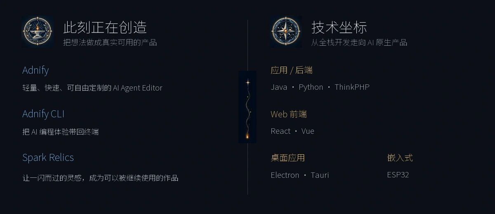

  

  <h2>方寸代码藏山海，一行一思筑星河。</h2>

  

    你好，我是 adnaan。 
    我做 AI 工具、桌面应用和一些有趣的小产品， 
    也在 <a href="https://github.com/Spark-Relics">Spark Relics</a> 收藏值得留下的开源创意。
  

  

    <a href="https://www.adnaan.site">Blog</a> ·
    <a href="https://github.com/ad-naan?tab=repositories">Projects</a> ·
    <a href="https://gitee.com/adnaan">Gitee</a> ·
    <a href="mailto:adnaan.worker@gmail.com">Email</a>
  

  

  

    <a href="https://github.com/ad-naan/Adnify">Adnify</a> ·
    <a href="https://github.com/ad-naan/Adnify-Cli">Adnify CLI</a> ·
    <a href="https://github.com/Spark-Relics">Spark Relics</a>
  

  道虽迩，不行不至；事虽小，不为不成。

    

  

